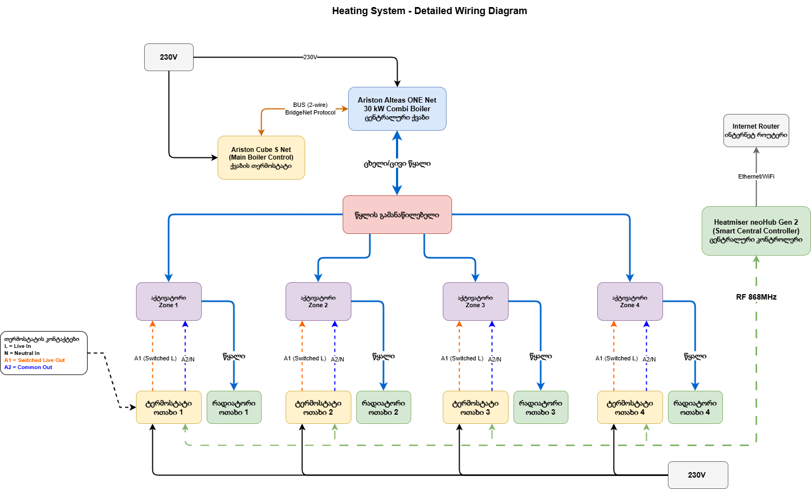

# Heating System Documentation

## System Overview

This repository contains documentation and monitoring tools for a multi-zone radiator heating system with individual zone control.

## Hardware Components

### Boiler
- **Model**: Ariston Alteas ONE Net 30 kW Combi
- **Type**: Combination boiler
- **Connectivity**: BUS BridgeNet protocol (proprietary)

### Control Systems
- **Boiler Controller**: Ariston Cube S Net (WiFi-enabled, controls boiler via BUS)
- **Room Thermostats**: Heatmiser neoStat v2 (one per room zone, 4 total)
- **Bathroom Control**: Manual or always-on (no thermostats)

### Distribution
- **Manifold**: Henco UFH-0605MDSS0X stainless steel manifold with flow meters (6 zones, 0-5 L/min per zone)
- **Actuators**: Heatmiser TA230 (230V AC, normally closed, 2-wire)

### Radiators
- **Room Radiators**: Stelrad Classic Compact Panel Radiators (4 units)
- **Bathroom Radiators**: Standard bathroom radiators (2 units)

## Zone Configuration

The system manages 6 independent heating zones:

### Room Zones (4 zones with thermostats)
Each room zone includes:
- Heatmiser neoStat v2 room thermostat
- Heatmiser TA230 actuator on manifold
- Stelrad Classic Compact Panel Radiator

### Bathroom Zones (2 zones without thermostats)
Each bathroom zone includes:
- Heatmiser TA230 actuator on manifold
- Bathroom radiator
- Manual or always-on control

## System Architecture

### Water Distribution
```
Ariston Alteas ONE Net Boiler
    ↓ (hot water supply/return)
Henco Stainless Steel Manifold
    ↓ (6 independent circuits)
6x TA230 Actuators (mounted on manifold)
    ↓ (controlled water flow)
4x Room Radiators + 2x Bathroom Radiators
```

### Electrical Control
```
230V AC Mains Supply
    ↓
Ariston Cube S Net ←→ Boiler (BUS connection)
    ↓
4x neoStat v2 Thermostats (rooms only)
    ↓ (switched 230V control)
6x TA230 Actuators
    ↓ (open/close manifold valves)
Individual zone heating control
```

## Wiring Details

### Heatmiser neoStat v2 Connections
- **L** - Live input (230V AC)
- **N** - Neutral input
- **A1** - Switched Live output (to actuator)
- **A2** - Common/Neutral output (to actuator)
- **RT1, RT2** - Optional floor sensor (10kΩ NTC)

### Heatmiser TA230 Actuator
- **2-Wire Connection**: Live and Neutral from thermostat
- **Operation**: Normally Closed (NC) - opens when 230V applied
- **Response Time**: ~3 minutes to fully open
- **Mounting**: M30 x 1.5 thread on manifold return port

### Ariston Cube S Net
- **Connection**: 2-wire BUS to boiler
- **Protocol**: BridgeNet (proprietary, not OpenTherm)
- **Function**: Controls boiler operation, NOT individual zones
- **Connectivity**: WiFi for Ariston NET app

## Diagrams

### Wiring Diagram

<picture>
  <source media="(prefers-color-scheme: dark)" srcset="images/wiring-diagram.dark.png">
  <source media="(prefers-color-scheme: light)" srcset="images/wiring-diagram.light.png">
  
</picture>

### Editable Source Files

- **heating-system.drawio** - Overall system architecture showing water and electrical connections
- **wiring-diagram.drawio** - Detailed wiring specifications and terminal connections

Open these files with [draw.io](https://app.diagrams.net) for viewing and editing.

## Cable Specifications

### Power Supply to Thermostats
- **Cable Type**: 2-core + earth (Twin & Earth)
- **Size**: 2.5mm² or 1.5mm²
- **Cores**: Live (Brown), Neutral (Blue), Earth (Green/Yellow)
- **Standard**: BS 6004 or equivalent

### Thermostat to Actuator
- **Cable Type**: 2-core cable
- **Size**: 0.75mm² to 1.5mm²
- **Cores**:
  - Wire 1: Switched Live from A1
  - Wire 2: Neutral/Common from A2
- **Max Length**: Up to 50m (low current - 2W per actuator)

### Recommended Cable Setup
```
Mains 230V Supply
    ↓ (2.5mm² Twin & Earth)
[Junction Box]
    ↓ (1.5mm² Twin & Earth)
neoStat v2 Thermostat
    ↓ (0.75-1.5mm² 2-core)
TA230 Actuator
```

## Important Notes

⚠️ **Safety and Installation**
- All electrical work must be performed by a qualified electrician
- System operates on 230V AC - disconnect power before any work
- Actuators are normally closed - valves close when power is removed
- Each thermostat requires dedicated 230V supply (L + N)
- All installations must comply with local electrical regulations
- Always connect earth to thermostat backplate
- Keep low voltage and mains cables separated

**System Operation**
- Room thermostats independently control their zones
- When thermostat calls for heat, it provides 230V to actuator
- Actuator opens manifold valve, allowing hot water to radiator
- Cube S Net manages overall boiler operation and scheduling
- Bathroom zones may require manual switching or timer control

## System Optimization Recommendations

### Priority 1: High Impact Improvements

#### 1. Floor Temperature Sensors
**For rooms with tile/stone floors:**
- Connects to neoStat RT1/RT2 terminals
- 10kΩ NTC thermistor sensors
- Prevents floor overheating
- Improves temperature regulation

**Cost:** £60-100 (4 sensors) | **Annual Savings:** £40-60 | **Payback:** 2 years

### Priority 2: Optional Improvements

#### 2. Smart Hub Integration (Optional)
**Heatmiser neoHub Gen 2:**
- Centralized control of all neoStat thermostats via smartphone app
- Smart scheduling, geo-location, and remote access
- Voice control (Alexa, Google Home, HomeKit)
- Energy monitoring and usage tracking per room
- **Requirements**: Ethernet or WiFi connection, USB 5V power (PoE not supported)
- **Placement**: Near router, within 50m of at least one neoStat (mesh networking extends range)
- **Cost**: £120-150

**Cost:** £120-150 | **Annual Savings:** £100-200 | **Payback:** 1-2 years

#### 3. Wiring Centre Consolidation
**Alternative to direct wiring:** Heatmiser UH8 Wiring Centre
- Centralizes all wiring in one location
- Easier troubleshooting and maintenance
- Cleaner cable management
- Built-in pump control

**Cost:** £180-220 | **Benefit:** Convenience, not energy savings

#### 4. Boiler Optimization
**Settings to Check:**
- **CH Temperature**: Set to 60-70°C for radiators (not 80°C+)
- **Pump Speed**: Adjust based on system resistance
- **Weather Compensation**: Enable if available (10-15% savings)
- **Anti-Cycling**: Set minimum run times

## Optimization Action Plan

### Immediate (Do Now)
1. ✅ **Optimize boiler settings** (temperature, pump speed)
2. ✅ **Balance manifold** flow rates using built-in flow meters

### Short Term (1-3 months)
3. ⚙️ Install floor sensors (if tile/stone floors)

### Long Term (Future)
4. 🔧 Consider smart hub integration for remote control
5. 🔧 Consider wiring centre during major rewiring
6. 💰 Monitor and optimize based on usage data

## Cost-Benefit Summary

| Upgrade | Cost | Annual Savings | Payback Period | Priority |
|---------|------|----------------|----------------|----------|
| Floor Sensors | £60-100 | £40-60 | 2 years | **HIGH** |
| Boiler Optimization | £0 | £50-100 | Immediate | **HIGH** |
| Smart Hub (neoHub) | £120-150 | £100-200 | 1-2 years | Medium |
| Wiring Centre | £180-220 | N/A | N/A | Low |
