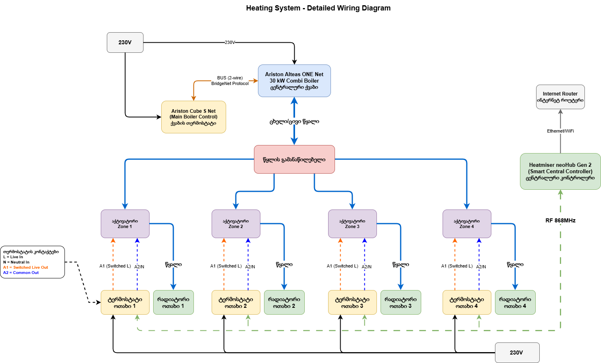

# H-MON — Home Heating Monitoring System

Multi-zone hydronic heating system for a 6-room home, with individual room temperature control via Heatmiser smart thermostats and Giacomini manifold distribution. Two separate Ariston boilers — one dedicated to central heating, one dedicated to domestic hot water (DHW).

## Rooms

### 1. Bedroom 1 — Radiator

Primary bedroom with panel radiator. Requires individual temperature control via dedicated thermostat and manifold circuit. One actuator on the manifold controls water flow to the radiator.

### 2. Bedroom 2 — Radiator

Second bedroom with panel radiator. Requires individual temperature control via dedicated thermostat and manifold circuit. One actuator on the manifold controls water flow to the radiator.

### 3. Bedroom 3 — Radiator

Third bedroom with panel radiator. Shares a thermostat zone with another room or operates on a fixed schedule. Connected to the manifold via its own circuit and actuator.

### 4. Bathroom 1 — Towel Rail with Manual TRV

Bathroom with heated towel rail. No smart thermostat — temperature is controlled by a manual thermostatic radiator valve (TRV) attached directly to the towel rail. Connected to the manifold via its own circuit and actuator, but temperature regulation is handled locally by the TRV rather than by a neoStat. The UH8-N zone actuator opens the manifold port when any heating zone calls for heat, and the TRV limits the towel rail temperature independently.

### 5. Bathroom 2 — Towel Rail with Manual TRV

Second bathroom with heated towel rail. Same setup as Bathroom 1 — manual TRV on the towel rail for local temperature control. Connected to the manifold via its own circuit and actuator. No neoStat thermostat needed.

### 6. Studio — Underfloor Heating

Open workspace with underfloor heating loops. Requires dedicated thermostat with floor temperature sensor (10k NTC on RT1/RT2 terminals) to prevent floor overheating. Lower water temperature needed — the Giacomini R559NY005 mixing group regulates supply temperature before distribution. UH8-N Zone 8 should be set to UFH mode to enable pump/valve outputs.

## Devices

### Boilers

| # | Device | Purpose | Status |
|---|--------|---------|--------|
| 1 | Ariston Clas ONE System 24 kW | Central Heating | To Buy |
| 2 | Ariston Clas ONE Combi 24 kW | Domestic Hot Water | To Buy |

**Ariston Clas ONE System 24 kW** — Dedicated heating-only system boiler. Provides hot water to the manifold circuit for radiators and underfloor heating. Does not produce domestic hot water. Built-in expansion vessel and circulation pump simplify installation. Modulating burner adjusts output from ~8 kW to 24 kW based on demand. Connected to the Heatmiser UH8-N via volt-free Heat Enable contacts (LS/E/LR terminals) — the UH8-N signals this boiler to fire whenever any heating zone calls for heat. 24 kW is sufficient for 6 rooms (5 radiator circuits + 1 underfloor circuit).

**Ariston Clas ONE Combi 24 kW** — Dedicated domestic hot water boiler, used only for its instantaneous DHW capability. Delivers mains-pressure hot water on demand at ~11 L/min (35C rise) — enough for one shower at a time. No hot water cylinder or tank needed. The central heating side of this combi is not used (capped off). Operates independently — heats water instantly when a tap is opened, no signal from the UH8-N required. If two simultaneous showers are needed, upgrade to the 30 kW variant (~13 L/min).

### Control

| # | Device | Qty | Status |
|---|--------|-----|--------|
| 3 | Heatmiser UH8-N — 8 Zone 12V Wiring Centre | 1 | Have |
| 4 | Heatmiser neoStat 12V V3 — Smart Thermostat | 4 | Have |
| 5 | Heatmiser neoHub G3 — Smart Hub | 1 | Have |

**Heatmiser UH8-N** — Central wiring hub that connects all thermostats and controls all actuators. Accepts 230V mains input and provides 12V power to up to 8 neoStat thermostats. When a thermostat calls for heat, the UH8-N switches 230V to the corresponding zone actuator on the manifold. The volt-free Heat Enable output (LS/E/LR terminals) signals the Ariston Clas ONE System boiler to fire whenever any zone demands heat. The DHW combi boiler operates independently and does not need a UH8-N connection. Has dedicated UFH pump and UFH valve outputs for underfloor heating zones. Zone 8 has a RAD/UFH switch — set to UFH to enable pump and valve control for the studio's underfloor circuit. Wiring follows the "UH8-N – neoStat-12v and Hot Water Zone" diagram from the UH8-N manual.

**Heatmiser neoStat 12V V3** — Room thermostat powered by 12V from the UH8-N (via +/- terminals). Measures room temperature and sends a call for heat signal (A1/A2 terminals) back to the UH8-N when heating is needed. Supports an optional floor temperature sensor (RT1/RT2 terminals, 10k NTC) for underfloor heating zones to limit floor surface temperature. Communicates wirelessly with the neoHub for smart scheduling, app control, and remote access. 4 units cover 4 zones: 3 bedrooms + 1 studio. Bathrooms use manual TRVs instead.

**Heatmiser neoHub G3** — Smart hub that connects to all neoStat thermostats wirelessly (mesh network, up to 50m range). Provides smartphone app control, smart scheduling, geolocation-based heating, and voice assistant integration (Alexa, Google Home, HomeKit). Connects to the home network via Ethernet or WiFi. Placed near the router. Enables monitoring and control of all heating zones from anywhere.

### Distribution

| # | Device | Qty | Status |
|---|--------|-----|--------|
| 6 | Giacomini R559NY005 — Mixing Group, 5 circuits | 1 | To Buy |
| 7 | Giacomini R553ZY005 — Brass Manifold, 5 outlets | 1 | To Buy |
| 8 | Giacomini R473X221 — Thermo-electric Actuator, 230V NC | 10 | To Buy |
| 9 | Giacomini R500Y222 — Flush-mount Cabinet | 1 | To Buy |
| 10 | Giacomini R179AM — Pipe Adapters, Base 18 (16x2mm) | 20 | To Buy |

**Giacomini R559NY005** — Pre-assembled mixing group that sits between the Ariston Clas ONE System heating boiler and the distribution manifold. Regulates and lowers the water temperature from the boiler before it enters the manifold circuits — essential for underfloor heating which requires lower temperatures (30-45C) than the boiler outputs (60-80C). Includes a 3-way mixing valve, primary and secondary lockshield valves for balancing, delivery temperature probe housing, circulator pump connection point, manual air vents, charge/discharge cocks, and immersion thermometer housings. Connects to boiler supply/return on one side and to the R553Z manifold on the other.

**Giacomini R553ZY005** — Pre-assembled brass distribution manifold with 5 outlet circuits. The supply side has lockshield valves with flow regulation (adjustable with R558 key) to balance water flow between circuits. The return side has thermostatic valve connections where the R473X actuators mount (M30x1.5 thread). Each of the 5 outlets feeds one room circuit — radiator or underfloor loop. Adapters R178 or R179 (base 18mm) connect the 16x2mm pipes to the manifold ports.

**Giacomini R473X221** — Thermo-electric actuator (230V, normally closed). Mounts on the return side of the R553Z manifold via M30x1.5 thread. When the UH8-N sends 230V to a zone output, the actuator heats a wax element that pushes the valve open, allowing water to flow through that circuit. Normally closed means the valve stays shut when power is off — a safety feature that prevents uncontrolled heating. Response time is approximately 3 minutes. 10 units provide 2 per circuit (flow + return) for full isolation, or allow spare capacity for future zone splits.

**Giacomini R500Y222** — Flush-mount wall cabinet that houses the R559N mixing group and R553Z manifold assembly. Recessed into the wall for a clean installation. Provides access for maintenance and flow adjustment while keeping the manifold protected and out of sight.

**Giacomini R179AM** — Pipe adapters with 18mm base for connecting 16x2mm multilayer (PEX-AL-PEX) pipes to the R553Z manifold outlets. Each manifold circuit needs 2 adapters (supply + return), and with 5 circuits that's 10 minimum — 20 units provide spares for the mixing group connections and any future extensions.

## Diagrams

Editable source files in `diagrams/` — open with [draw.io](https://app.diagrams.net):

- `heating-system.drawio` — Overall system architecture
- `wiring-diagram.drawio` — Wiring connections (v1)
- `wiring-diagram-v2.drawio` — Wiring connections (v2, current)

Exported images in `images/`:

<picture>
  <source media="(prefers-color-scheme: dark)" srcset="images/wiring-diagram.dark.png">
  <source media="(prefers-color-scheme: light)" srcset="images/wiring-diagram.light.png">
  
</picture>

## UH8-N Wiring Diagram Version

The UH8-N manual includes four wiring configurations. The correct one for this system is marked below:

| Diagram | Description | For This System? |
|---------|-------------|-----------------|
| UH8-N – Slimline-N and Hot Water Zone | Slimline-N thermostats with hot water cylinder control | No — we use neoStat 12V, not Slimline-N |
| UH8-N – neoStat-12v and Radiator Zone | neoStat 12V thermostats, heating only, no hot water zone | No — we have a separate DHW boiler that needs the H Water zone |
| **UH8-N – neoStat-12v and Hot Water Zone** | **neoStat 12V thermostats with radiator, UFH, and hot water zones** | **Yes — matches our setup** |
| Wiring Diagram – Connecting Multiple UH8-N's | Linking two or more UH8-N units together | No — we have a single UH8-N with 8 zones |

**Why "neoStat-12v and Hot Water Zone":**
- We use **neoStat 12V V3** thermostats (not Slimline-N)
- We have **two boilers** — the heating boiler connects to UH8-N Heat Enable, and the DHW combi boiler can be wired to the H Water zone for on/off scheduling via neoHub
- We have both **radiator zones** (bedrooms, bathrooms) and a **UFH zone** (studio)
- We only need **one UH8-N** — 8 zones is enough for 6 rooms

## Documentation

Manufacturer PDFs in `docs/`:

- `uh8-n-manual.pdf` — Heatmiser UH8-N installation manual and wiring diagrams
- `R559N-1.pdf` — Giacomini R559NY mixing group instructions and flow scheme
- `R553D.pdf` — Giacomini R553Z manifold technical sheet and regulation guide
